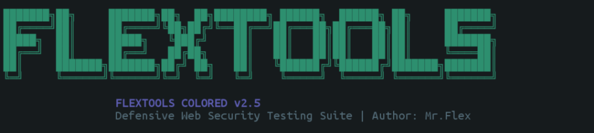
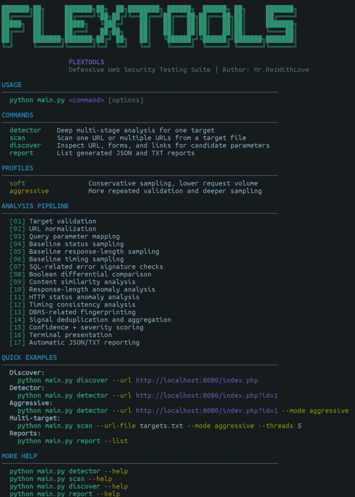
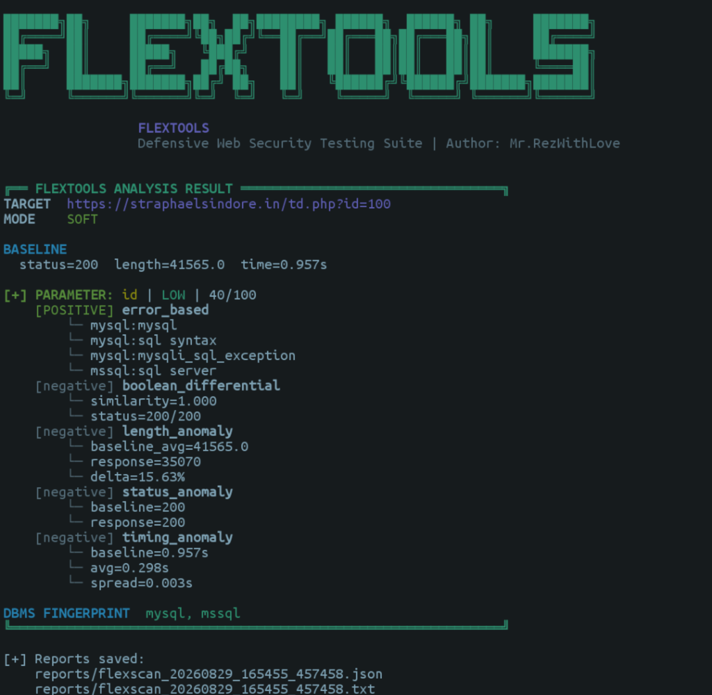

FlexTools V1.0

<p align="center">
  
</p><p align="center">
  <strong>Python-Based Web Security Scanner & Input Anomaly Detector</strong>
</p><p align="center">
  Parameter Discovery • Multi-Stage Analysis • Automated Detection • Detailed Reporting
</p>---

Overview

FlexTools Colored is a Python-based web security testing tool designed to analyze web application inputs, parameters, and response behavior.

The tool uses a structured multi-stage analysis process to collect and compare HTTP responses. Instead of relying on a single indicator, FlexTools combines multiple signals to identify suspicious behavior and generate a confidence score.

The analysis may include:

- HTTP response status changes
- Response length differences
- Content similarity analysis
- SQL-related error signatures
- Boolean response differences
- Response timing anomalies
- Database-related error fingerprinting
- Parameter discovery and analysis

All results are displayed in the terminal and automatically saved as reports.

---

Features

- Multi-stage detection pipeline
- Automatic URL parameter detection
- HTML form input discovery
- Link parameter discovery
- Baseline response collection
- HTTP status analysis
- Response length analysis
- Content similarity comparison
- SQL-related error signature detection
- Boolean differential analysis
- Timing analysis
- Database-related error fingerprinting
- Confidence scoring
- Severity classification
- Colored terminal interface
- Single target analysis
- Multiple target scanning
- Soft and aggressive scan modes
- Automatic JSON reporting
- Automatic TXT reporting

---

Screenshots

Help Menu

<p align="center">
  
</p>Scan Result

<p align="center">
  
</p>---

Installation

Requirements

Make sure the following software is installed:

- Python 3.8 or newer
- Git
- pip

Check your Python version:

python --version

Check Git:

git --version

---

Installation on Termux

Update installed packages:

pkg update && pkg upgrade -y

Install Python and Git:

pkg install python git -y

Clone the repository:

git clone https://github.com/LFAzx/FlexTools.git

Enter the project directory:

cd FlexTools

Install dependencies:

pip install -r requirements.txt

Verify the installation:

python main.py --help

---

Installation on Linux

For Debian or Ubuntu:

sudo apt update
sudo apt install python3 python3-pip git -y

Clone the repository:

git clone https://github.com/LFAzx/FlexTools.git

Enter the project:

cd FlexTools

Install dependencies:

pip3 install -r requirements.txt

Run FlexTools:

python3 main.py --help

---

Usage

Display the main help menu:

python main.py --help

Available commands:

detector    Analyze a single target
scan        Scan one or multiple targets
discover    Discover candidate parameters
report      View generated reports

Display command-specific help:

python main.py detector --help

python main.py scan --help

python main.py discover --help

python main.py report --help

---

Parameter Discovery

The "discover" command searches a target page for candidate input parameters.

FlexTools can identify parameters from:

- Existing URL query parameters
- HTML input fields
- HTML select fields
- HTML textarea fields
- Links containing query parameters

Example:

python main.py discover --url "http://localhost:8080/index.php"

---

Detector Mode

The "detector" command performs a deeper analysis against a single target.

Example:

python main.py detector --url "http://localhost:8080/index.php?id=1"

Using aggressive mode:

python main.py detector \
  --url "http://localhost:8080/index.php?id=1" \
  --mode aggressive

Using a custom timeout:

python main.py detector \
  --url "http://localhost:8080/index.php?id=1" \
  --timeout 15

---

Scan Mode

The "scan" command can process a single target or multiple targets.

Single Target

python main.py scan \
  --url "http://localhost:8080/index.php?id=1"

Multiple Targets

Create a file named "targets.txt":

http://localhost:8080/index.php?id=1
http://localhost:8080/product.php?item=10
http://localhost:8080/search.php?q=test

Run the scanner:

python main.py scan --url-file targets.txt

Use multiple threads:

python main.py scan \
  --url-file targets.txt \
  --threads 5

---

Scan Profiles

Soft Mode

Soft mode performs lighter analysis with fewer requests.

Recommended for:

- Initial testing
- Quick analysis
- Lower request volume

Example:

python main.py detector \
  --url "http://localhost:8080/index.php?id=1" \
  --mode soft

---

Aggressive Mode

Aggressive mode performs additional sampling and repeated validation.

Recommended for:

- Deeper analysis
- Reproducibility checks
- Controlled testing environments

Example:

python main.py detector \
  --url "http://localhost:8080/index.php?id=1" \
  --mode aggressive

---

## Detection Workflow

```text
Target URL
    │
    ▼
Target Validation
    │
    ▼
Parameter Discovery
    │
    ▼
Baseline Response Collection
    │
    ▼
Multi-Stage Analysis
    │
    ├── Error Analysis
    ├── Boolean Analysis
    ├── Length Analysis
    ├── Status Analysis
    ├── Timing Analysis
    └── Database Error Fingerprinting
    │
    ▼
Signal Aggregation
    │
    ▼
Confidence Scoring
    │
    ▼
Severity Classification
    │
    ▼
Terminal Output
    │
    ▼
JSON + TXT Reports
```

---

## Reporting

FlexTools automatically saves analysis results.

Default report directory:

```text
reports/
```

Reports may include:

```text
reports/
├── report_YYYYMMDD_HHMMSS.json
└── report_YYYYMMDD_HHMMSS.txt
```

List generated reports:

```bash
python main.py report --list
```

Use a custom report directory:

```bash
python main.py report --list --dir results
```

---

## Project Structure

```text
FlexTools/
│
├── assets/
│   ├── banner.png
│   ├── help-menu.png
│   └── scan-result.png
│
├── core/
│   ├── baseline.py
│   ├── colors.py
│   ├── config.py
│   ├── http_client.py
│   ├── models.py
│   ├── normalizer.py
│   └── scoring.py
│
├── detector/
│   ├── boolean_based.py
│   ├── error_based.py
│   ├── fingerprint.py
│   ├── length_analysis.py
│   ├── status_analysis.py
│   └── timing_analysis.py
│
├── reporting/
│   ├── colored_help.py
│   ├── report_manager.py
│   └── terminal.py
│
├── scanner/
│   ├── discovery.py
│   ├── engine.py
│   ├── target_loader.py
│   └── url_parser.py
│
├── main.py
├── requirements.txt
├── README.md
├── LICENSE
└── .gitignore
```

---

Module Overview

Core

The "core" directory contains shared functionality used throughout the application, including:

- HTTP request handling
- Baseline collection
- Configuration
- Response normalization
- Data models
- Confidence scoring
- Terminal colors

Scanner

The "scanner" directory handles:

- Target loading
- URL parsing
- Parameter discovery
- Scan orchestration

Detector

The "detector" directory contains the analysis modules:

- Error-based analysis
- Boolean differential analysis
- Response length analysis
- HTTP status analysis
- Timing analysis
- Database-related error fingerprinting

Reporting

The "reporting" directory handles:

- Colored terminal output
- Help interface
- JSON report generation
- TXT report generation

---

Quick Start

git clone https://github.com/LFAzx/FlexTools.git

cd FlexTools

pip install -r requirements.txt

python main.py --help

Discover candidate parameters:

python main.py discover \
  --url "http://localhost:8080/index.php"

Run analysis:

python main.py detector \
  --url "http://localhost:8080/index.php?id=1" \
  --mode aggressive

---

Disclaimer

FlexTools is intended for authorized security testing, development environments, security research, education, and controlled laboratory environments.

Only test systems that you own or have explicit permission to assess.

Automated results should be manually reviewed and validated.

---

Author

Mr.RezWithLove

<p align="center">
  <strong>FlexTools Colored v1.0</strong>
</p><p align="center">
  Built for structured web security testing and analysis.
</p>
